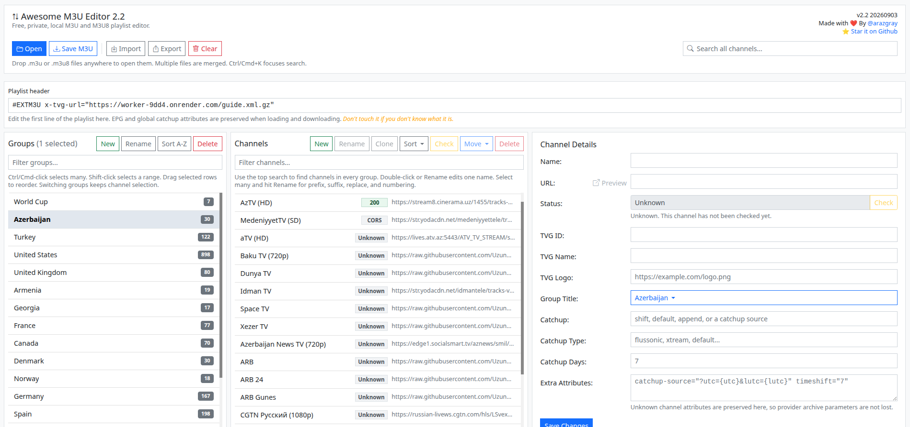

# Awesome M3U Editor 2.2

[](https://github.com/arazgray/awesome-m3u-editor/blob/main/LICENSE)
[](https://github.com/arazgray/awesome-m3u-editor/stargazers)

A free, private, browser-based editor for M3U and M3U8 IPTV playlists.

Open a playlist, organize groups and channels, edit channel details, check stream URLs, and download the cleaned playlist. Everything runs in your browser. Your playlist is not uploaded anywhere.

🔗 **Live**: [https://arazgray.github.io/awesome-m3u-editor/](https://arazgray.github.io/awesome-m3u-editor/)

## Screenshot


## What's new in 2.2 (20260903)

- New app toolbar: **Open**, **Save M3U**, **Import**, **Export**, **Clear**, and search
- Drag and drop `.m3u` / `.m3u8` files onto the page to open them
- Search channels across every group, not only the open list
- Switching groups keeps the selected channels
- Channel logo thumbnails in the details pane
- Import and export the full editor project (header, groups, channels, and statuses)
- Automatic project backup before Clear, deleting groups, Import, or replacing the current playlist
- Open several playlists at once; they are merged on load
- Bulk rename selected channels with prefix, suffix, find/replace, and numbering
- Loading overlay with real progress while a playlist is opened (reading the file, finding channels, building the list)
- Warning before opening playlists larger than 100 MB, and a clear error if a file cannot be read
- Empty or invalid files no longer wipe the current playlist or overwrite the playlist header

## Main features

- Open one or more `.m3u` and `.m3u8` playlists; multiple files are merged on load
- Drag and drop playlist files onto the page to open them
- Search channels across every group
- Import and export the full editor project (groups, channels, and statuses)
- Edit the playlist header, including EPG URLs
- Create, rename, move, sort, and delete groups
- Create, rename, move, sort, and delete channels
- Bulk rename selected channels with prefix, suffix, find/replace, and numbering
- Select one channel, many channels, or a range of channels
- Drag and drop groups and channels
- Filter groups and channels
- Move selected channels to another group
- Edit channel name, URL, TVG fields, logo, group, catchup fields, and extra attributes
- Preview channel logos in the details pane
- Preserve unknown provider attributes instead of deleting them
- Preview channel URLs
- Check selected channels only
- Queue selected channels and check them 5 at a time
- Show channel status such as `Queued`, `Checking`, `200`, `403`, `404`, `CORS`, `Blocked`, `Bad URL`, `Unsupported`, and `No URL`
- Sort channels A-Z or by status
- Save progress in local browser storage
- Download the edited playlist as a new `.m3u` file

## Sample playlists

```txt
# All TV channels grouped by category
https://iptv-org.github.io/iptv/index.category.m3u

# All TV channels grouped by language
https://iptv-org.github.io/iptv/index.language.m3u

# All TV channels grouped by country
https://iptv-org.github.io/iptv/index.country.m3u
```

## How to use

1. Open the live demo or run `index.html` locally.
2. Click **Open** or drop `.m3u` / `.m3u8` files onto the page. Several files are merged into one playlist.
3. Use the top search box to find channels in every group. Switching groups keeps the selected channels.
4. Edit groups, channels, URLs, and metadata. **Export** saves the whole editor project; **Import** restores it.
5. Select several channels and click **Rename** to add a prefix or suffix, replace text, or add numbers. Double-click still renames one channel.
6. Select channels and click **Check** to test only those channels.
7. Use **Sort** to sort channels A-Z or by status.
8. Click **Save M3U** when you are done.

## Run locally

```bash
git clone https://github.com/arazgray/awesome-m3u-editor.git
cd awesome-m3u-editor
```

Then open `index.html` in your browser.

## Privacy

Awesome M3U Editor works locally in your browser. Your playlist is not sent to a server.

## Notes about status checking

Browser-based checking has limits. Some IPTV servers block browser status checks with CORS. When that happens, the app shows `CORS` instead of guessing whether the stream is alive or dead.

## License

MIT License. See [LICENSE](LICENSE) for details.

---

Made with ❤️ by [@arazgray](https://github.com/arazgray) | [Star on GitHub](https://github.com/arazgray/awesome-m3u-editor)
